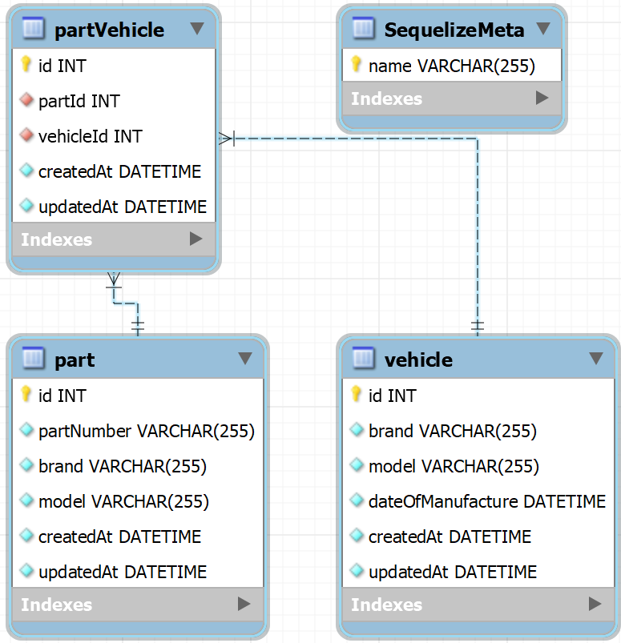

# Automec

## Links

- [Automec repositório](https://github.com/Moyseys/automec)
- [Design Figma](https://www.figma.com/design/Xxo5upk6sEN3jDbZsZLfI8/automec?node-id=0-1&t=oo1xklXGsIlBgE9S-1)
- [Vídeo apresentação Automec](https://1drv.ms/v/s!AtSD-zjYedAQr8N4_HXDvSF8IcdfWA?e=0tbdhG)

## Inicialização

### Instale as dependências do Back-End.

```bash
cd API
npm install
```

### Configure as variáveis de ambiente.

Crie um arquivo `.env` na raiz da pasta API e preencha as variáveis de acordo com seu ambiente.

```bash
DATABASE=
DATABASE_HOST=
DATABASE_PORT=
DATABASE_USERNAME=
DATABASE_PASSWORD=

API_PORT=
```

### Criação do banco de dados.

Faça a criação do banco de dados.

```bash
CREATE DATABASE automec
```

### Migração de tabela.

Utilize a CLI do `Sequelize` para realizar a criação das tabelas.

**Obs:** deve-se estar na pasta `/API` para executar a migração

```bash
npx sequelize db:migrate       
```

### Semeação de tabelas.

Utilize a CLI do `Sequelize` para semear suas tabelas.

**Obs:** deve-se estar na pasta `/API` para executar a migração

```bash
npx sequelize db:seed:all
```

### Inicie o Back-End.

```bash
npm run build
npm start
```

### Instale as dependências do Front-End.

```bash
cd FrontEnd
npm install
```

### Inicie o Front-End.

```bash
npm start
```

# Tecnologias

### Front-End

- Angular.
- TaigaUI (Biblioteca de componentes).
- XLSX (Biblioteca para realizar exportação de planilhas).
- Jasmine (Framework de testes).

### Back-End

- NodeJs.
- Express.
- Sequelize (ORM).
- Mysql.

### Design

- Figma.

# Diagrama logico do banco de dados

